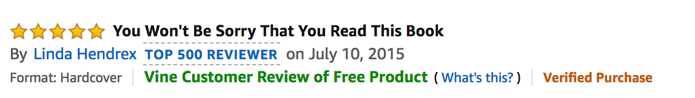

<<<<<<< HEAD
# "Alexa, can you handle big data?"

## Background

Many of Amazon's shoppers depend on product reviews to make a purchase. Amazon makes these datasets publicly available. However, they are quite large and can exceed the capacity of local machines to handle. One dataset alone contains over 1.5 million rows; with over 40 datasets, this can be quite taxing on the average local computer. The goal of this project was to perform the ETL process completely in the cloud and upload the DataFrame to an RDS instance. The second goal was to use PySpark and SQL to perform a statistical analysis of the selected data.

1. Created DataFrames to match production-ready tables from two big Amazon customer review datasets: digital video games and digital music.
2. Analyzed whether reviews from Amazon's Vine program are trustworthy.

## Level 1

* Created tables in a RDS database.

* Created two separate Google Colaboratory notebooks and **extracted** the digital video game and digital music datasets from the list at [review dataset](https://s3.amazonaws.com/amazon-reviews-pds/tsv/index.txt), one into each notebook.

* For each dataset, I completed the following:

  * Counted the number of records (rows) in the dataset.

  * **Transformed** the dataset to fit the tables in the [schema file](level-1/schema.sql).

  * **Loaded** the DataFrames that correspond to tables into an RDS instance.

## Level 2

In Amazon's Vine program, reviewers receive free products in exchange for reviews.

Amazon has several policies to reduce the bias of its Vine reviews: [https://www.amazon.com/gp/vine/help?ie=UTF8](https://www.amazon.com/gp/vine/help?ie=UTF8).

Investigated whether Vine reviews are free of bias. Used SQL to analyze the data.
=======
# Amazon-Shoppers-Analysis-BIG-DATA-
 "Alexa, can you handle big data?"

Create a new repository for this project called big-data-challenge. Do not add this homework to an existing repository.
Clone the new repository to your computer.
Inside your local git repository, create a directory for the level of challenge Challenge you choose. Use folder names corresponding to the challenges: level-1 or  level-2.

Add your converted ZEPL notebook to this folder. This will be the main script to run for analysis. Be sure to also add any SQL queries you used to a .sql file and add it to your repo.

Push the above changes to GitHub or GitLab.

Note
Keep in mind that this homework is optional! However, you will gain a much greater understanding of ETL processes in Big Data using PySpark and using AWS's Relational Databases if you do complete it.

Background
In this assignment you will put your ETL skills to the test. Many of Amazon's shoppers depend on product reviews to make a purchase. Amazon makes these datasets publicly available. However, they are quite large and can exceed the capacity of local machines to handle. One dataset alone contains over 1.5 million rows; with over 40 datasets, this can be quite taxing on the average local computer. Your first goal for this assignment will be to perform the ETL process completely in the cloud and upload a DataFrame to an RDS instance. The second goal will be to use PySpark or SQL to perform a statistical analysis of selected data.
There are two levels to this homework assignment. The second level is optional but highly recommended.

Create DataFrames to match production-ready tables from two big Amazon customer review datasets.
Analyze whether reviews from Amazon's Vine program are trustworthy.

Instructions

Level 1
Use the furnished schemata to create tables in your RDS database.
Create two separate ZEPL notebooks and extract any two datasets from the list at review dataset, one into each notebook.
Note: It is possible to ETL both data sources in a single notebook, but due to the large data sizes, it will be easier to work with these S3 data sources in two separate ZEPL notebooks.

Be sure to handle the header correctly. If you read the file without the header parameter, you may find that the column headers are included in the table rows.
For each notebook (one dataset per notebook), complete the following:
Count the number of records (rows) in the dataset.

Transform the dataset to fit the tables in the schema file. Be sure the DataFrames match in data type and in column name.
Load the DataFrames that correspond to tables into an RDS instance. Note: This process can take up to 10 minutes for each. Be sure that everything is correct before uploading.

Level 2 (Optional)
In Amazon's Vine program, reviewers receive free products in exchange for reviews.
Amazon has several policies to reduce the bias of its Vine reviews: https://www.amazon.com/gp/vine/help?ie=UTF8.
But are Vine reviews truly trustworthy? Your task is to investigate whether Vine reviews are free of bias. Use either PySpark or—for an extra challenge—SQL to analyze the data.

If you choose to use SQL, first use Spark on ZEPL to extract and transform the data and load it into a SQL table on your RDS account. Perform your analysis with SQL queries on RDS.
While there are no hard requirements for the analysis, consider steps you can take to reduce noisy data, e.g., filtering for reviews that meet a certain number of helpful votes, total votes, or both.

Submit a summary of your findings and analysis.
Resources
customer review datasets

Hints and Considerations
Consult the troubleshooting guide for handling issues with ZEPL.

Be sure that every cell begins with %pyspark in ZEPL. This specifies the interpreter, and you must have one for each cell. If you import a Jupyter notebook in ZEPL, be sure to delete %python, which is automatically added to each cell.

Submission
Copy your ZEPL notebooks into Jupyter Notebooks and upload those to GitHub.
Copy your SQL queries into .sql files and upload to GitHub.
Important: Do not upload notebooks that contain your RDS password and endpoint. Be sure to delete them before making your notebook public!
>>>>>>> 833b20c9a61e00d4dcfaf1773124cc1f5e590c99
